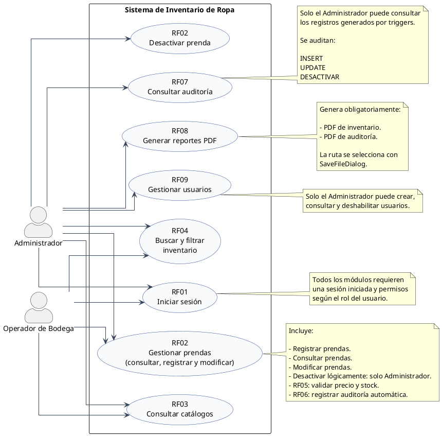

```plantuml
@startuml
left to right direction

skinparam shadowing false
skinparam packageStyle rectangle
skinparam actorStyle awesome
skinparam linetype ortho
skinparam nodesep 35
skinparam ranksep 45

skinparam usecase {
  BackgroundColor #F8FAFC
  BorderColor #1E3A8A
  ArrowColor #334155
}

actor "Administrador" as Admin
actor "Operador de Bodega" as Operador

rectangle "Sistema de Inventario de Ropa" {

  usecase "RF01\nIniciar sesión" as Login

  usecase "RF02\nGestionar prendas\n(consultar, registrar y modificar)" as Prendas
  usecase "RF02\nDesactivar prenda" as Desactivar

  usecase "RF03\nConsultar catálogos" as Catalogos

  usecase "RF04\nBuscar y filtrar\ninventario" as Filtros

  usecase "RF07\nConsultar auditoría" as Auditoria

  usecase "RF08\nGenerar reportes PDF" as Reportes

  usecase "RF09\nGestionar usuarios" as Usuarios
}

' Funciones del Administrador
Admin --> Login
Admin --> Prendas
Admin --> Desactivar
Admin --> Catalogos
Admin --> Filtros
Admin --> Auditoria
Admin --> Reportes
Admin --> Usuarios

' Funciones del Operador de Bodega
Operador --> Login
Operador --> Prendas
Operador --> Catalogos
Operador --> Filtros

note right of Login
Todos los módulos requieren
una sesión iniciada y permisos
según el rol del usuario.
end note

note right of Prendas
Incluye:

- Registrar prendas.
- Consultar prendas.
- Modificar prendas.
- Desactivar lógicamente: solo Administrador.
- RF05: validar precio y stock.
- RF06: registrar auditoría automática.
end note

note right of Auditoria
Solo el Administrador puede consultar
los registros generados por triggers.

Se auditan:

INSERT
UPDATE
DESACTIVAR
end note

note right of Reportes
Genera obligatoriamente:

- PDF de inventario.
- PDF de auditoría.

La ruta se selecciona con
SaveFileDialog.
end note

note right of Usuarios
Solo el Administrador puede crear,
consultar y deshabilitar usuarios.
end note

@enduml
```
