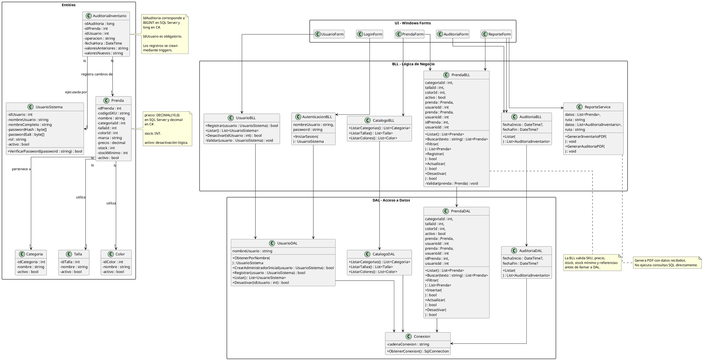

```plantuml
@startuml

skinparam classAttributeIconSize 0
skinparam shadowing false
skinparam packageStyle rectangle
skinparam linetype ortho
skinparam nodesep 45
skinparam ranksep 55

hide empty members

package "Entities" {

  class Prenda {
    - idPrenda : int
    - codigoSKU : string
    - nombre : string
    - categoriaId : int
    - tallaId : int
    - colorId : int
    - marca : string
    - precio : decimal
    - stock : int
    - stockMinimo : int
    - activo : bool
  }

  class Categoria {
    - idCategoria : int
    - nombre : string
    - activo : bool
  }

  class Talla {
    - idTalla : int
    - nombre : string
    - activo : bool
  }

  class Color {
    - idColor : int
    - nombre : string
    - activo : bool
  }

  class UsuarioSistema {
    - idUsuario : int
    - nombreUsuario : string
    - nombreCompleto : string
    - passwordHash : byte[]
    - passwordSalt : byte[]
    - rol : string
    - activo : bool
    + VerificarPassword(password : string) : bool
  }

  class AuditoriaInventario {
    - idAuditoria : long
    - idPrenda : int
    - idUsuario : int
    - operacion : string
    - fechaHora : DateTime
    - valoresAnteriores : string
    - valoresNuevos : string
  }
}

package "BLL - Lógica de Negocio" {

  class AutenticacionBLL {
    + IniciarSesion(
        nombreUsuario : string,
        password : string
      ) : UsuarioSistema
  }

  class UsuarioBLL {
    + Registrar(usuario : UsuarioSistema) : bool
    + Listar() : List<UsuarioSistema>
    + Desactivar(idUsuario : int) : bool
    - Validar(usuario : UsuarioSistema) : void
  }

  class PrendaBLL {
    + Listar() : List<Prenda>
    + Buscar(texto : string) : List<Prenda>
    + Filtrar(
        categoriaId : int,
        tallaId : int,
        colorId : int,
        activo : bool
      ) : List<Prenda>
    + Registrar(
        prenda : Prenda,
        usuarioId : int
      ) : bool
    + Actualizar(
        prenda : Prenda,
        usuarioId : int
      ) : bool
    + Desactivar(
        idPrenda : int,
        usuarioId : int
      ) : bool
    - Validar(prenda : Prenda) : void
  }

  class CatalogoBLL {
    + ListarCategorias() : List<Categoria>
    + ListarTallas() : List<Talla>
    + ListarColores() : List<Color>
  }

  class AuditoriaBLL {
    + Listar(
        fechaInicio : DateTime?,
        fechaFin : DateTime?
      ) : List<AuditoriaInventario>
  }

  class ReporteService {
    + GenerarInventarioPDF(
        datos : List<Prenda>,
        ruta : string
      ) : void
    + GenerarAuditoriaPDF(
        datos : List<AuditoriaInventario>,
        ruta : string
      ) : void
  }
}

package "DAL - Acceso a Datos" {

  class Conexion {
    - cadenaConexion : string
    + ObtenerConexion() : SqlConnection
  }

  class PrendaDAL {
    + Listar() : List<Prenda>
    + Buscar(texto : string) : List<Prenda>
    + Filtrar(
        categoriaId : int,
        tallaId : int,
        colorId : int,
        activo : bool
      ) : List<Prenda>
    + Insertar(
        prenda : Prenda,
        usuarioId : int
      ) : bool
    + Actualizar(
        prenda : Prenda,
        usuarioId : int
      ) : bool
    + Desactivar(
        idPrenda : int,
        usuarioId : int
      ) : bool
  }

  class CatalogoDAL {
    + ListarCategorias() : List<Categoria>
    + ListarTallas() : List<Talla>
    + ListarColores() : List<Color>
  }

  class UsuarioDAL {
    + ObtenerPorNombre(
        nombreUsuario : string
      ) : UsuarioSistema
    + CrearAdministradorInicial(usuario : UsuarioSistema) : bool
    + Registrar(usuario : UsuarioSistema) : bool
    + Listar() : List<UsuarioSistema>
    + Desactivar(idUsuario : int) : bool
  }

  class AuditoriaDAL {
    + Listar(
        fechaInicio : DateTime?,
        fechaFin : DateTime?
      ) : List<AuditoriaInventario>
  }
}

package "UI - Windows Forms" {

  class LoginForm
  class PrendaForm
  class AuditoriaForm
  class ReporteForm
  class UsuarioForm
}

' Relaciones entre entidades
Prenda "N" --> "1" Categoria : pertenece a
Prenda "N" --> "1" Talla : utiliza
Prenda "N" --> "1" Color : utiliza

AuditoriaInventario "N" --> "1" Prenda : registra cambios de
AuditoriaInventario "N" --> "1" UsuarioSistema : ejecutada por

' UI se comunica únicamente con BLL o servicios
LoginForm --> AutenticacionBLL
PrendaForm --> PrendaBLL
PrendaForm --> CatalogoBLL
AuditoriaForm --> AuditoriaBLL
ReporteForm --> ReporteService
ReporteForm --> PrendaBLL
ReporteForm --> AuditoriaBLL
UsuarioForm --> UsuarioBLL

' BLL se comunica con DAL
AutenticacionBLL --> UsuarioDAL
UsuarioBLL --> UsuarioDAL
PrendaBLL --> PrendaDAL
CatalogoBLL --> CatalogoDAL
AuditoriaBLL --> AuditoriaDAL

' DAL utiliza la conexión
PrendaDAL --> Conexion
CatalogoDAL --> Conexion
UsuarioDAL --> Conexion
AuditoriaDAL --> Conexion

note right of Prenda
precio: DECIMAL(10,0)
en SQL Server y decimal
en C#.

stock: INT.

activo: desactivación lógica.
end note

note right of AuditoriaInventario
IdAuditoria corresponde a
BIGINT en SQL Server y
long en C#.

IdUsuario es obligatorio.

Los registros se crean
mediante triggers.
end note

note bottom of PrendaBLL
La BLL valida SKU, precio,
stock, stock mínimo y referencias
antes de llamar a DAL.
end note

note bottom of ReporteService
Genera PDF con datos recibidos.
No ejecuta consultas SQL directamente.
end note

@enduml
```
