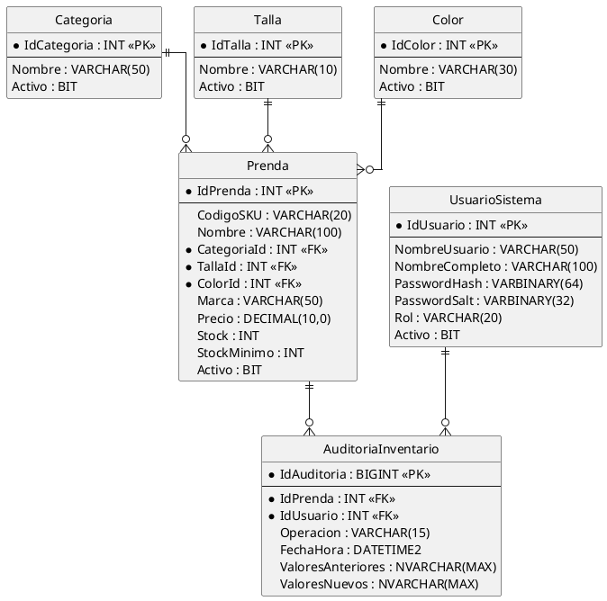

# Modelo Relacional — Sistema de Inventario de Ropa

**Proyecto:** Sistema de Inventario de Ropa — Tienda Moda Urbana
**Asignatura:** Programación Segura
**Fuente:** derivado del diagrama de clases (`docs/diagrama-clases.puml`), paquete `Entities`

## 1. Diccionario de datos

### 1.1 Categoria
| Columna | Tipo | Restricciones |
|---|---|---|
| IdCategoria | INT | PK, IDENTITY |
| Nombre | VARCHAR(50) | NOT NULL, UNIQUE |
| Activo | BIT | NOT NULL, DEFAULT 1 |

Catálogo cargado por script de datos de prueba. `Activo` se deja reservado para una futura pantalla de mantenimiento; en esta versión no tiene CRUD desde la aplicación.

### 1.2 Talla
| Columna | Tipo | Restricciones |
|---|---|---|
| IdTalla | INT | PK, IDENTITY |
| Nombre | VARCHAR(10) | NOT NULL, UNIQUE |
| Activo | BIT | NOT NULL, DEFAULT 1 |

Mismo criterio que `Categoria`.

### 1.3 Color
| Columna | Tipo | Restricciones |
|---|---|---|
| IdColor | INT | PK, IDENTITY |
| Nombre | VARCHAR(30) | NOT NULL, UNIQUE |
| Activo | BIT | NOT NULL, DEFAULT 1 |

Mismo criterio que `Categoria`.

### 1.4 Prenda
| Columna | Tipo | Restricciones |
|---|---|---|
| IdPrenda | INT | PK, IDENTITY |
| CodigoSKU | VARCHAR(20) | NOT NULL, UNIQUE |
| Nombre | VARCHAR(100) | NOT NULL |
| CategoriaId | INT | NOT NULL, FK → Categoria(IdCategoria) |
| TallaId | INT | NOT NULL, FK → Talla(IdTalla) |
| ColorId | INT | NOT NULL, FK → Color(IdColor) |
| Marca | VARCHAR(50) | NULL |
| Precio | DECIMAL(10,0) | NOT NULL, CHECK (Precio > 0) |
| Stock | INT | NOT NULL, CHECK (Stock >= 0), DEFAULT 0 |
| StockMinimo | INT | NOT NULL, CHECK (StockMinimo >= 0), DEFAULT 0 |
| Activo | BIT | NOT NULL, DEFAULT 1 |

`Marca` es NULL porque no todas las prendas (ej. accesorios básicos) necesitan marca declarada.

### 1.5 UsuarioSistema
| Columna | Tipo | Restricciones |
|---|---|---|
| IdUsuario | INT | PK, IDENTITY |
| NombreUsuario | VARCHAR(50) | NOT NULL, UNIQUE |
| NombreCompleto | VARCHAR(100) | NOT NULL |
| PasswordHash | VARBINARY(64) | NOT NULL |
| PasswordSalt | VARBINARY(32) | NOT NULL |
| Rol | VARCHAR(20) | NOT NULL, CHECK (Rol IN ('Administrador','Operador de Bodega')) |
| Activo | BIT | NOT NULL, DEFAULT 1 |

Hash y sal en `VARBINARY` porque PBKDF2 produce bytes, no texto; evita conversiones innecesarias.

### 1.6 AuditoriaInventario
| Columna | Tipo | Restricciones |
|---|---|---|
| IdAuditoria | BIGINT | PK, IDENTITY |
| IdPrenda | INT | NOT NULL, FK → Prenda(IdPrenda) |
| IdUsuario | INT | NOT NULL, FK → UsuarioSistema(IdUsuario) |
| Operacion | VARCHAR(15) | NOT NULL, CHECK (Operacion IN ('INSERT','UPDATE','DESACTIVAR')) |
| FechaHora | DATETIME2 | NOT NULL, DEFAULT SYSDATETIME() |
| ValoresAnteriores | NVARCHAR(MAX) | NULL |
| ValoresNuevos | NVARCHAR(MAX) | NULL |

`ValoresAnteriores`/`ValoresNuevos` en JSON (`FOR JSON PATH`) — es la única columna no atómica del modelo, y es una excepción deliberada: guardar una fotografía completa del registro es más simple y más útil para auditoría que normalizar cada campo cambiado en su propia fila.

## 2. Diagrama entidad-relación

## 3. Normalización

### 3.1 Primera Forma Normal (1FN)
Todas las tablas cumplen 1FN: cada columna contiene un valor atómico (sin listas ni valores repetidos), y cada tabla tiene una clave primaria explícita e `IDENTITY`. No hay grupos repetitivos: por ejemplo, `Prenda` no guarda varias tallas o colores en una sola fila — cada combinación es una fila distinta con su propio SKU, tal como se definió en la Fase 0.

### 3.2 Segunda Forma Normal (2FN)
Todas las claves primarias son de una sola columna (no compuestas), por lo que no puede existir dependencia parcial. 2FN se cumple automáticamente en las seis tablas.

### 3.3 Tercera Forma Normal (3FN)
No hay dependencias transitivas: ningún atributo no clave depende de otro atributo no clave.
- En `Prenda`, extraer `Categoria`, `Talla` y `Color` a tablas propias evita que el nombre de la categoría dependa indirectamente de `CategoriaId` a través de texto repetido — es justamente lo que evita la redundancia (si no existieran, `Prenda.NombreCategoria` dependería de `CategoriaId`, no de `IdPrenda`, violando 3FN).
- En `AuditoriaInventario`, `Operacion`, `FechaHora`, etc. dependen únicamente de `IdAuditoria`, no entre sí.
- Única excepción documentada: `ValoresAnteriores`/`ValoresNuevos` como JSON no están en 1FN estricta a nivel de sus campos internos, pero la tabla en sí sí lo está (la columna completa es un valor atómico de tipo texto). Se documenta como decisión de diseño, no como incumplimiento accidental.

## 4. Integridad referencial

| FK | Tabla origen | Tabla destino | Acción ON DELETE |
|---|---|---|---|
| CategoriaId | Prenda | Categoria | NO ACTION |
| TallaId | Prenda | Talla | NO ACTION |
| ColorId | Prenda | Color | NO ACTION |
| IdPrenda | AuditoriaInventario | Prenda | NO ACTION |
| IdUsuario | AuditoriaInventario | UsuarioSistema | NO ACTION |

`NO ACTION` en todas las FK porque el sistema **nunca elimina físicamente** ninguna fila (ni prendas, ni catálogos, ni usuarios) — todo baja lógicamente mediante `Activo`. Esto además garantiza que el historial de `AuditoriaInventario` jamás quede huérfano, requisito de RNF08.

Restricciones adicionales que refuerzan RF05 y RNF04: `UNIQUE` en `CodigoSKU`, `Nombre` de catálogos y `NombreUsuario`; `CHECK` en `Precio`, `Stock`, `StockMinimo`, `Rol` y `Operacion`; `DEFAULT` en las columnas `Activo` y en `FechaHora`.

## 5. Próxima fase

Con este modelo cerrado, la Fase 3 traduce estas tablas a los scripts `database/02_crear_tablas.sql`, `03_insertar_datos_prueba.sql`, y luego los procedimientos almacenados y triggers de auditoría — sin cambiar aquí ningún nombre de columna, para que el código no tenga que ajustarse después.